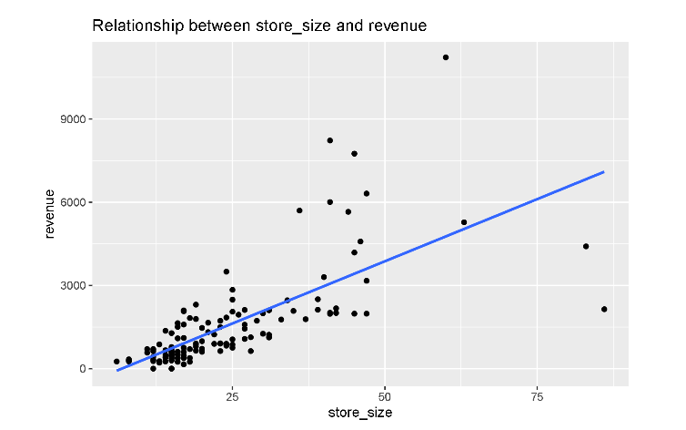
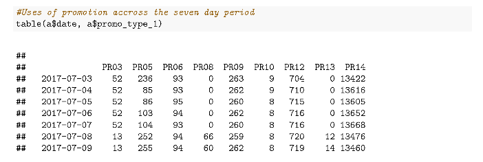
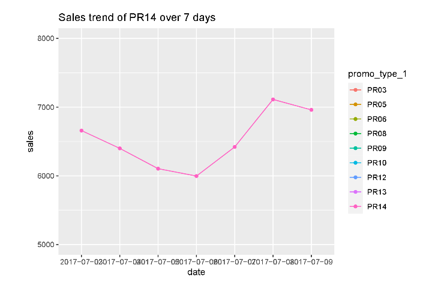

by: [QuangDongNguyen](https://github.com/Quang2003-SpicyCarrot)  
provided by: Western Sydney University

  


 


# Projects: Busines Analysis with Dawson Steward Analytics
## Table of Contents:
- [I. Business Overview](#business-overview-dawson-steward---data-consultancy-firm)
- [II. Dataset](#dataset)
- [III. Business Problem](#business-problem)
- [IV. Library used in R](#iv-library-used-in-r)
- [V. Method](#v-method)
- [VI. Steps Summary](#vi-steps-summary)
- [VII. Quick glance at the results](#vii-quick-glance-at-the-results)


## I. Business Overview: Dawson Steward - Data Consultancy Firm
Your company, Dawson Steward Analytics, a consultancy firm specialised in AI analytics is tasked by a
retail chain in the northern hemisphere to analyse their sales data. 


## II. Dataset:
The data are provided by the business and are contained in three different sets:
sales: daily sales data over a seven day period, containing the following columns:  
- store id – the unique identifier of a store  
- product id – the unique identifier of a product  
- date – sales date (YYYY-MM-DD)  
- sales – sales quantity  
- revenue – daily total sales revenue  
- price – product sales price  
- promo type 1 – type of promotion applied on product  
- promo bin 1 – binned promotion rate for promotion type  
- promo discount 2 – discount rate for applied promotion  
- promo discount type 2 – type of discount applied  


Product hierarchy: data containing the hierarchy and sizes of products:  
- product id – the unique identifier of a product  
- product length – length of product  
- product depth – depth of product  
- produc width – width of product  
- hierarchy1 id – barcode hierarchy of product. The most general hierarchy. For example:
fords and beverages.  
- hierarchy2 id – This is the second level hierarchy. For example: beverages  
- hierarchy3 id – Third level hierarchy, e.g. Cola  
- hierarchy4 id – Forth level hierarchy, e.g. Pepsi cola without sugar  
- hierarchy5 id – Fifth level hierarchy, e.g. pepsi cola without sugar 300ML  
store cities: data containing the city, type and size information of the stores  
- store id – the unique identifier of a store  
- storetype id – type of store  
- store size  
- city id  


## III. Business problem:  
1. Question 1
- Compute the total revenue of each store at the end of each day.
- Is there a noted difference between the days? 
- Write also the code to calculate the total revenue over the seven day period. 
- Plot the latter on a graph.  

2. Question 2
- What’s the most popular product type (hierarchy 1) sold in all stores over a week? 
- How much revenue did the stores receive for that product during the week? 
- How does that compare with the second most popular product? 
- Provide a table that shows the product type ranked from most to least popular. 
- For each product type provide: how many subtypes (hierarchy 2) are there, 
- how many products are in this product type, what’s the sales quantity, and the revenue generated.  

3. Question 3
- Compare the sales volumes between the two most common store types in the data set. 
- How do they compare in terms of total revenue? 
- Is there a relationship between a store’s size and its revenue?  

4. Question 4
- Several different types of promotions were applied to the products during the period with various
level of promotion rates. For each promotion type, display the different levels of promotion used
during the period.
- Analyse the effectiveness of the promotion on the sales of the products.  


## IV. Library used in R
- tidyverse
- kableExtra

## V. Method:
- Data Manipulation and Data Cleaning (Transforming, NA removing, etc.)
- Data Visualisation (interactive and non-interactive (required some R packages))
- Hypothesis testing (general correlation test)
- Predictive analysis


## VI. Steps summary:
```
Question 1:
|- import libraries
|Part 1:
|- Use aggregate() to calculate the total revenueof each store at the end of each day
|
|Part 2:
|- Use tappy() to calculate the differences in revenues between each day
|
|Part 3:
|- Use aggregate() to search for the total revenue generated from each store over seven days
|
|Plotting:
|- Plot the total revenue obtained over seven days by each store to see the correlation and comment on the graph.


Question 2:
|Part 1:
|- Join the two datasets (a ("sales_ug") and b ("product_hierarchy")) by the "product_id" key in both tables.
|- Sort table based on the counts of the types of products sold over a week, H00 is the most sold prodct type
|
|Part 2:
|- From the previous merged table, we selected rows that has the "hierarchy1_id" variable == "H00" (the most sold product type)
|- Show the revenue of each store received from that product type during the week, using aggregate() with sum function
|
|Part 3:
|- Selectively choose rows from the merged table that have "hierarchy1_id" == "H01" (the second most sold product type)
|- Review the revenue eaned of each store from that product type during the week.
|- Comparison:
|           |- Give reasons why we use full-join on aggregated tables.
|           |- The merged table will have empty rows on revenues, hence I replaced NA values with 0 
|           |- Then calculate the total revenue earned by each store from product type "H00" and "H01"
|           |- Rename the column to store_id, H00.revenue, H01.revenue and revenue differences for each of the 4 aggregated columns.
|           |- Displays the final result table that shows how much each store made in total for "H00" and "H01" product types and the 
|              differences in revenues of these two product types.
|           |- Visualise the revenue differences.
|
|Part 4:
|- Sort table showing the product ranked from most to least popular. H00 and H01 is the most popular type according to the ranking
|
|Part 5:
|- Create a table showing how many subtype products there are for each product type (there are 4 types, H00, H01, H02, and H03)
|
|Part 6:
|- Comment on how many products there are in the subtype products category of each product type.
|
|Part 7:
|- Showing the sales quantity for each hierarchy_id type throught the use of aggregate() with sum function
|- Further provide detailed information on the contribution of each subtype product within every hierarchy_id to the total sales
|- Share product-driven insights collected from previous information of every product sale.
|
|Part 8:
|- Use aggregate() with sum function to calculate the total revenue from each product type.


Question 3:
|Part 1:
|- "ST04" is the most common store type based on ranking table and "ST03" is the second most common
|- Merge two data tables "d" and "a' together using right join on "a" by "store_id"
|- Check the sale volumes between the two most common store type using aggregate with sum function. ST04 has the higher sale volumes
|
|Part 2:
|- In terms of revenue, ST04 made more revenues than ST03 store type, based on the aggregated table.
|
|Part 3:
|- Perform a hypothesis test on correlation to see if there is a relation between a store's size and its total revenue. Based on the result,
there is a significant relationship between store_size and revenue.
|- Fit a linear model on the aggregated data to see if the model is accurate. Based on the result, there is a linear relationship between store_size and revenue.
|- Visualise the aggregated data to see the relationship between store_size and its revenue.


Question 4:
|Part 1:
|- To display different levels of promotion during the period, we create a summary table of promotion types and its levels.
|     |- First, show the number of promotion levels of each promotion type
|     |- then, we show the amount of promotions used across seven-day period
|     |- If we dwell deeper, we will find how many promotions were used on each day and what level of promotions was used for discount
|
|Part 2:
|- Analyse the effectiveness of the promotion on the sales of the products
|- Visualise Sales trends accross seven-day period by each promotion type, and shares my understanding of the impact of promotions over sales.

```


## VII. Quick glance at the results:
**Visualisation of total revenue obtained by each store over seven-day period.**


**Correlation between store size and revenue.**

- During the assessment of data, we have been asked to show assess the relationship between the store_size and revenue. It is commonly believed that
during a bull market, the size of shop correlates with the gain in revenue. The bigger a shop is, the more profitable it will become. 
    - A reasonable explanation could be customer could get most of items on their wishlist without travelling to multiple different stores. 
    - One-stop shopping - The ability to shop for multiple brands of items and services, including foods, entertainments, etc.
    - Secured environment results in feeling of safety and comfort while shopping.

Based on the correlation test, The result is shown below:  

| Correlation test             |Score           |
|------------------------------|----------------|
|Correlation coeff             |0.701293        |
|Confidence Interval (95%)     |0.60-0.77       |
|no.observations               |128             | 
|p-value                       |<0.05           |  

There is sufficient evidence to conclude there is a linear relationship between store_size and revenue at 5% significance level. Meaning it is noticeable that when a shop size is increased,
the profit margin will also stagnate.

To further assess on the type of relationship between store_size and revenue, a linear model is established on data:

| Linear model                 |Score           |
|------------------------------|----------------|
|Store_Size (p-val)            |<2e-16          |
|Store_size (std.error)        |8.117           |
|RSE                           |124 on 126 df   |
|Adjusted R-squared            |0.4878          |  

Based on the p-value of the model, there is a linear relationship between Store_size and revenue. However, since, RSE (residual standard error) is high,
and R-square is moderately low (~48%), meaning only 48% of the variance in the response variable (revenue) is explained. This means the data is linear and fan-shaped.

*Lesson learned and recommendation*
- Based on the result of the linear model, Store size is one of the most predictive features in determining the growth of business' revenue. Other features, for example, City, Promotion are also helpful.
- To improve the linear model, a transformation process with log function could be implemented into the model to reduce variance in the data (the fan-like shape of data)


**Number of promotions used over the past 7 days.**
  
- PR14 promotion type has the highest number of uses by customers over the past 7 days. On average, the number of PR14 promotion was used per day is approximately 13,000 in counts.
And the second most used promotion type is PR09, which only accounts for almost 300 uses per day. Between the two most popular promotion types, there is a significant jump of uses, however, both promotions are consistent in the number of uses by consumers throughout the 7 days.


*Lesson learned and recommendation*
- Promotion has a significant impact on sales of a business. 
- Various promotion types are served for different purposes of buying of customers and they are neccessary to keep a business on track.


**Total sales obtained over 7-day period by PR14 promotion type.**



