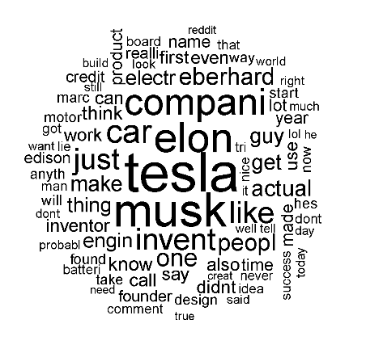
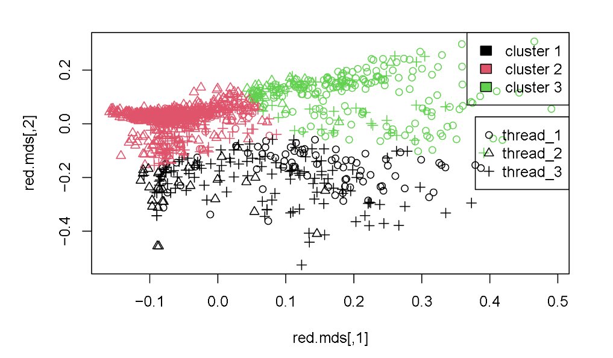
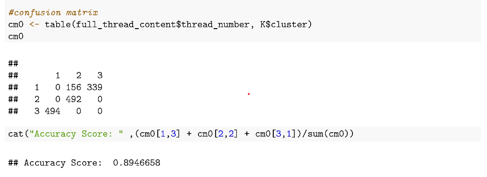
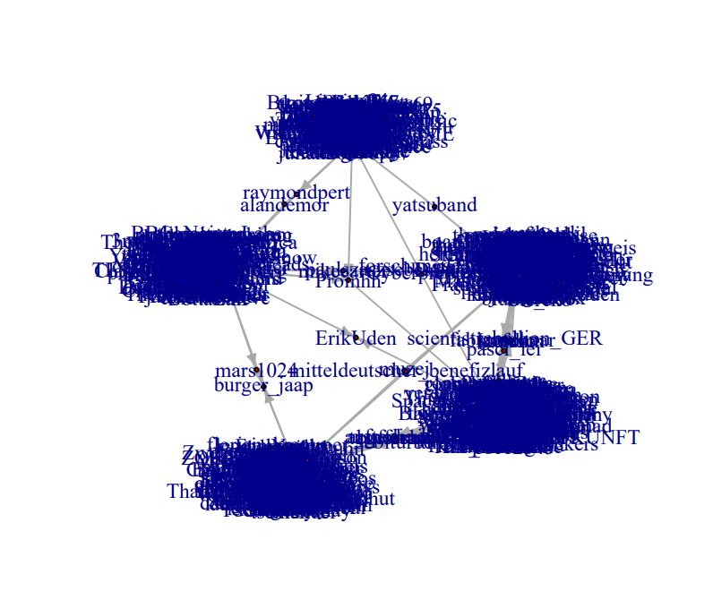

by: [QuangDongNguyen](https://github.com/Quang2003-SpicyCarrot) and et,al.  
provided by: Western Sydney University

  

# Key findings: Perform a social media analysis to find any related trend of topics or users on the social media platforms (Mastodon and Reddit)

## Table of Contents:
- [Problems](#problems)
- [Data Source](#data-source)
- [Library used](#library-used-in-r)
- [Methods](#method)
- [Quick review of the results](#quick-review-of-the-results)
- [Explore the notebook](#explore-the-notebook)

## Problems:
To get start, I will pick a topic of my interests that I would like to explore through the entire project. This is a group project, hence I collaborated with other
3 student members to work throughout the whole project.  Note that:
- The relevant terminology may differ between Reddit and Mastodon APIs, spending
time reading about APIs and R packages and relevant functions, is expected.  
- Reddit and Mastodon APIs are introductory and required  to
investigate more on the relevant R functions and the data structure.  
- Some research/preparation into downloaded data organisation is required, as data
frames usually contain one or more columns of interest to select and filter on.  

### Question 1:
1. Using Reddit API, identify the relevant thread URL's for your chosen topic. Focus
on either weekly or monthly timeframe.  
2. Find the top three threads with the highest number of comments.  
3. Retrieve and display the main post from from each of these three threads. Generate
a word cloud for the comments and replies within each of these threads, resulting in
a word cloud for each thread.  
4. Comment on the generated word clouds. Explain the key discussions and topics being
addressed in each of the three thread.  

### Question 2:
1. Combine all the threads collected in question 1 and create a column to label
them with their thread number.
2. For example, label the first thread comments as "1", label the second thread
comments as "2", label the third thread comments as "3".
3. Next, apply K-means clustering to cluster the combined threads.
4. Visualise the results of your clustering in two-dimensional vector space. Ensure that
your visualisation includes both the clusters and the original labels of the
documents.
5. Comment on the findings. Assess the performance of K-means clustering in terms
of correctly identifying clusters. Did it effectively identify the clusters?

### Question 3:
1. Use all thread URLs on Reddit that is identified in question 1.
2. Test if there exists a linear relationship between the number of comments in threads
and their corresponding dates. Note: remember to convert dates to a date format.

### Question 4:
1. Retrieve the content of the top thread identified in question 1.
2. Test whether the number of comments on a thread is equally likely on each day.

### Question 5:
1. Using Mastodon, identify users who are related to mychosen topic.  
2. Identify the top five most active users, based on the highest number of statuses
they've posted.  
3. Download 50 followers and 50 friends (these are the users that my user follows) of
these 5 top users.  
4. Create a graph and visualize the relationships among these users.  
Note 1: I can select any five users from the top 10 users for which I can
successfully obtain friend and follower data. During the extraction, I might encounter
limitations in downloading friends, such as discoverability issues or some users
having no friends.  
Note 2: If I downloaded fewer than 50 followers or friends for certain users that is completely acceptable.

### Question 6:
Find the most central users in the graph using all centrality measures and comments on the findings.

## Data Source:
- [Reddit APis: RedditExtractoR](https://cran.r-project.org/web/packages/RedditExtractoR/RedditExtractoR.pdf)
- [Mastodon APis: rtoot](https://cran.r-project.org/web/packages/rtoot/index.html)

## Library used in R:
- RedditExtractoR (APIs)
- kableExtra
- tm
- wordcloud
- ggplots
- SnowballC
- rtoot (APIs)

## Method:
- Text Mining
- TF-IDF (Term Frequency - Invert Document Frequency)
- K-means Clustering
- Network Graph (Directed and undirected graph), Centrality (Degree, Closeness, Betweeness Centrality)
- Chi-squared test
- PCA (principal component analysis)
- Linear Regression Modelling

## Quick review of the results: 

## Explore the notebook
To explore the notebook file: [R_file](https://github.com/Quang2003-SpicyCarrot/R_projects/blob/main/Project%202-%20Social%20Analysis%20with%20Reddit%20and%20Mastodon/Assignment1.R)